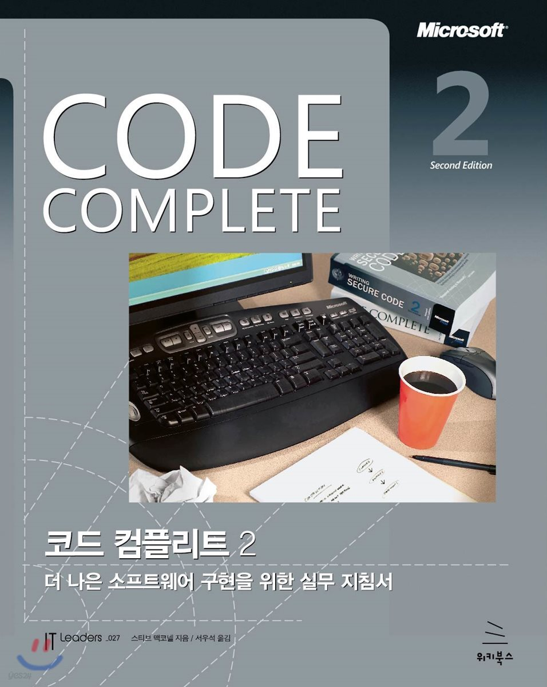

<div align="center">

# Code Complete 2판 한글 스터디

**변하지 않는 기술에 집중하는 7인의 프론트엔드 개발자 스터디**

[](https://hamsurang.github.io/code-complete-2/)
[](https://hamsurang.notion.site/2f845f0c788b80f9899aee806838614d?source=copy_link)

<br />


</div>

<br />

## 목적

매일 바뀌는 기술이 아닌, **변하지 않는 기술**에 집중합니다.  
Code Complete는 30년이 지난 지금도 유효한 소프트웨어 구현 원칙을 담고 있어요.  
7명의 프론트엔드 개발자가 함께 읽고, 토론하고, 2026년 FE 현업 관점으로 재해석합니다.

<br />

## 스터디원

<table>
  <tr>
    <td align="center" width="180">
      <a href="https://github.com/sHyunis">
        <br />
        <b>🦊 Alice</b>
      </a><br />
      <sub>정소현</sub><br />
      <sub><i>F-pretence 2년차 FE</i></sub>
    </td>
    <td align="center" width="180">
      <a href="https://github.com/doyoonear">
        <br />
        <b>🐵 Amber</b>
      </a><br />
      <sub>이도윤</sub><br />
      <sub><i>5년차 FE, 현 취준생</i></sub>
    </td>
  </tr>
  <tr>
    <td align="center" width="180">
      <a href="https://github.com/Kyujenius">
        <br />
        <b>🦎 Crong</b>
      </a><br />
      <sub>홍규진</sub><br />
      <sub><i>토큰 없으면 퇴근하는 1년차 FE</i></sub>
    </td>
    <td align="center" width="180">
      <a href="https://github.com/jangwonyoon">
        <br />
        <b>🦉 diego</b>
      </a><br />
      <sub>윤장원</sub><br />
      <sub><i>볼 50만원 5년차 FE</i></sub>
    </td>
  </tr>
  <tr>
    <td align="center" width="180">
      <a href="https://github.com/jxxunnn">
        <br />
        <b>🦜 Jay</b>
      </a><br />
      <sub>이준근</sub><br />
      <sub><i>헤어팟 없으면 코딩 못하는 3년차 FE</i></sub>
    </td>
    <td align="center" width="180">
      <a href="https://github.com/Seung-wan">
        <br />
        <b>🐻 Leo</b>
      </a><br />
      <sub>유승완</sub><br />
      <sub><i>이마트와 블로그 사이 4년차 FE</i></sub>
    </td>
  </tr>
  <tr>
    <td align="center" width="180">
      <a href="https://github.com/azure-553">
        <br />
        <b>🐿️ zinii</b>
      </a><br />
      <sub>심미진</sub><br />
      <sub><i>백근가가 생긴 개발자</i></sub>
    </td>
    <td align="center" width="180">
      <br />
      <b>📖 Code Complete</b><br />
      <sub>Steve McConnell</sub><br />
      <sub><a href="https://www.yes24.com/product/goods/44130507">책 사러 가기</a></sub>
    </td>
  </tr>
</table>

<br />

## 챕터 구성

| 파트 | 챕터 | 주제 |
|------|------|------|
| 🧭 구현의 기초 | 1–4장 | 소프트웨어 구현 기초, 메타포, 선행 조건 |
| 🧭 구현의 기초 | 5–6장 | 루틴 설계, 클래스 품질 |
| ✏️ 좋은 코드 쓰기 | 7–9장 | 고품질 루틴, 방어적 프로그래밍, 의사코드 |
| ✏️ 좋은 코드 쓰기 | 20–23장 | 소프트웨어 품질, 협업, 개발자 테스트, 디버깅 |
| 🔧 완성과 성장 | 24–26장 | 리팩터링, 코드 튜닝 전략·기법 |
| 🔧 완성과 성장 | 31–34장 | 레이아웃·자기문서화, 개인 성격, 소프트웨어 장인정신 |

<br />

## 로컬 개발

```bash
npm install -g pnpm
pnpm install
pnpm start
```

```bash
pnpm build
```

## 기여 방법

1. 이 저장소를 Fork합니다.
2. 담당 챕터의 MDX 파일을 수정합니다.
3. Pull Request를 생성합니다.
